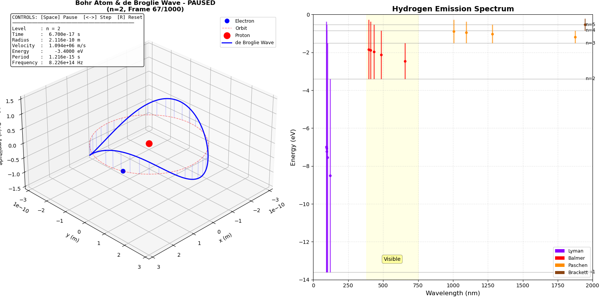

# Bohr Model Simulation: Hydrogen Atom & Quantum Mechanics

A computational physics project simulating the **Bohr model** of the hydrogen atom, including electron orbital dynamics, energy level calculations, emission spectra, and quantum wave functions.



## Overview

This project implements a comprehensive simulation of the hydrogen atom based on **Niels Bohr's atomic model** (1913). It combines classical orbital mechanics with quantum mechanical principles to visualize:

1. **Electron orbital motion** in quantized energy levels
2. **Hydrogen emission spectrum** (Lyman, Balmer, Paschen, Brackett series)
3. **de Broglie wave** visualization on the electron orbit
4. **Quantum wavefunction** evolution for a particle on a ring

---

## Physical Background

### The Hydrogen Atom

A hydrogen atom consists of:
- **1 Proton** (nucleus, positive charge)
- **1 Electron** (orbits the nucleus, negative charge)

The electron orbits the proton in **quantized energy levels** (not at arbitrary distances). These discrete orbital radii are called **quantum states**, labeled by the principal quantum number $n = 1, 2, 3, ...$

### Bohr Model Equations

#### 1. Orbital Radius
The radius of the $n$-th orbit is given by:

$$r_n = a_0 \cdot n^2$$

where:
- $a_0 = 5.29 \times 10^{-11}$ m is the **Bohr radius** (ground state, $n=1$)
- $n$ is the **principal quantum number** (1, 2, 3, ...)

#### 2. Electron Velocity
The orbital velocity in the $n$-th state:

$$v_n = \frac{e^2}{2\epsilon_0 h n}$$

where:
- $e = 1.602 \times 10^{-19}$ C (elementary charge)
- $\epsilon_0 = 8.854 \times 10^{-12}$ F/m (vacuum permittivity)
- $h = 6.626 \times 10^{-34}$ J·s (Planck's constant)

#### 3. Energy Levels
The total energy of the electron in the $n$-th state:

$$E_n = -\frac{13.6 \text{ eV}}{n^2}$$

The negative sign indicates the electron is **bound** to the nucleus (ionization energy = 13.6 eV).

#### 4. Photon Emission (Spectral Lines)
When an electron transitions from a higher energy level $n_2$ to a lower level $n_1$, it emits a photon with wavelength:

$$\frac{1}{\lambda} = R_H \left( \frac{1}{n_1^2} - \frac{1}{n_2^2} \right)$$

where $R_H = 1.097 \times 10^7$ m$^{-1}$ is the **Rydberg constant**.

The photon energy is:

$$E_{\text{photon}} = E_{n_1} - E_{n_2} = h f = \frac{hc}{\lambda}$$

---

## Project Structure

```
bohr_model/
├── main.c              # Main simulation entry point
├── bohr.h              # Header file with constants and function prototypes
├── utils.c             # Utility functions (radius, velocity, energy, wavelength)
├── specters.c          # Emission spectrum calculations (Lyman, Balmer, etc.)
├── wavefct.c           # Quantum wavefunction data (generated by simulation)
├── free_particle.c     # Free particle on a ring simulation
├── sim.py              # 3D animated visualization (Bohr orbit + de Broglie wave)
├── free_particle_sim.py # Wavefunction visualization for particle on ring
├── Makefile            # Build automation
├── data.csv            # Ground state orbital data (generated)
├── spectrum.csv        # Emission spectrum data (generated)
├── wavefct.csv         # Wavefunction evolution data (generated)
└── figue1.png          # Visualization screenshot
```

---

## Implementation Details

### C Programs

#### 1. **Ground State Simulation** ([utils.c](utils.c))
- Calculates electron position $(x, y)$ over time for the ground state ($n=1$)
- Uses classical circular motion: $x = r \cos(\omega t)$, $y = r \sin(\omega t)$
- Angular frequency: $\omega = v/r$
- Outputs to `data.csv`

#### 2. **Emission Spectrum Calculation** ([specters.c](specters.c))
Computes wavelengths and energies for four spectral series:

| Series     | Transitions   | Spectrum Region | Wavelength Range |
|------------|---------------|-----------------|------------------|
| **Lyman**  | $n \to 1$     | Ultraviolet     | 91-122 nm        |
| **Balmer** | $n \to 2$     | Visible         | 365-656 nm       |
| **Paschen**| $n \to 3$     | Infrared        | 820-1875 nm      |
| **Brackett**| $n \to 4$    | Far Infrared    | 1458-4051 nm     |

Example (Balmer series, visible light):
- $H\alpha$ (3→2): 656.3 nm (red)
- $H\beta$ (4→2): 486.1 nm (cyan)
- $H\gamma$ (5→2): 434.0 nm (blue)
- $H\delta$ (6→2): 410.2 nm (violet)

#### 3. **Quantum Wavefunction** ([main.c](main.c))
- Simulates the time-evolution of the wavefunction $\psi(x, t)$ for an electron on a circular orbit
- Wavefunction: $\psi(x, t) = \frac{1}{\sqrt{2\pi a_0}} e^{i(kx - \omega t)}$
- Wave number: $k = n/a_0$
- Angular frequency: $\omega = E/\hbar$
- Computes real part, imaginary part, and probability density: $|\psi|^2$

### Python Visualizations

#### 1. **3D Animated Bohr Model** ([sim.py](sim.py))
Creates an interactive 3D animation showing:
- **Left panel**: Electron orbit with superimposed de Broglie wave
  - Gray circle: classical orbit path
  - Blue wave: quantum mechanical wave ($n$ wavelengths fit the circumference)
  - Synchronizes wave crests with electron position
- **Right panel**: Emission spectrum diagram
  - Energy levels ($n=1$ to $n=5$)
  - Transition lines color-coded by series
  - Visible light region highlighted

**Controls**:
- `Space`: Pause/Resume
- `←/→`: Step backward/forward
- `R`: Reset to beginning
- `S`: Save screenshot
- `E`: Exit

#### 2. **Particle on a Ring** ([free_particle_sim.py](free_particle_sim.py))
Visualizes the quantum wavefunction for a free particle constrained to a circular path:
- 3D plot showing $\text{Re}(\psi)$ as height above the ring
- Demonstrates wave-particle duality and quantization

---

## Usage

### Compilation and Execution

```bash
# Compile C programs
make

# Run simulation (generates data.csv, spectrum.csv, wavefct.csv)
./main

# Run 3D visualization
python3 sim.py
```

### Expected Output

**Console output** (energy levels and spectrum):
```
=== BOHR MODEL - HYDROGEN ENERGY LEVELS ===

Level n | Radius (m)    | Velocity (m/s) | Energy (eV)
--------|---------------|----------------|-------------
   1    | 5.2900e-11    | 2.1877e+06     | -13.6000
   2    | 2.1160e-10    | 1.0939e+06     | -3.4000
   3    | 4.7610e-10    | 7.2923e+05     | -1.5111
   4    | 8.4640e-10    | 5.4693e+05     | -0.8500
   5    | 1.3225e-09    | 4.3754e+05     | -0.5440

=== HYDROGEN SPECTRUM (Selected Lines) ===

Balmer Series (Visible Light):
Transition | Wavelength (nm) | Energy (eV) | Color
-----------|-----------------|-------------|------------
  3 → 2    | 656.3           | 1.889       | Red (Hα)
  4 → 2    | 486.1           | 2.550       | Cyan (Hβ)
  5 → 2    | 434.0           | 2.856       | Blue (Hγ)
  6 → 2    | 410.2           | 3.022       | Violet (Hδ)
```

**Generated files**:
- `data.csv`: Electron position vs. time for ground state
- `spectrum.csv`: All spectral line wavelengths and energies
- `wavefct.csv`: Quantum wavefunction evolution data

---

## Key Results

### 1. Quantized Energy Levels
The simulation confirms that:
- Energy levels follow $E_n = -13.6/n^2$ eV
- Ground state ($n=1$) has the lowest energy (-13.6 eV)
- Ionization (removing electron) requires 13.6 eV

### 2. Hydrogen Spectrum
- Accurately reproduces the **Balmer series** visible lines (observed in stellar spectra)
- UV **Lyman series** (seen in quasar absorption)
- IR **Paschen/Brackett series** (important in astrophysics)

### 3. de Broglie Wave-Particle Duality
The animation demonstrates that:
- Exactly $n$ wavelengths fit around the orbit circumference
- Wave and particle pictures are **complementary**
- Quantization arises from the **standing wave condition**: $2\pi r_n = n\lambda$

---

## Physical Constants Used

| Constant               | Symbol      | Value                    |
|------------------------|-------------|--------------------------|
| Bohr radius            | $a_0$       | $5.29 \times 10^{-11}$ m |
| Electron mass          | $m_e$       | $9.109 \times 10^{-31}$ kg |
| Elementary charge      | $e$         | $1.602 \times 10^{-19}$ C |
| Vacuum permittivity    | $\epsilon_0$| $8.854 \times 10^{-12}$ F/m |
| Planck constant        | $h$         | $6.626 \times 10^{-34}$ J·s |
| Speed of light         | $c$         | $2.998 \times 10^8$ m/s |
| Rydberg constant       | $R_H$       | $1.097 \times 10^7$ m$^{-1}$ |
| Ionization energy      | -           | 13.6 eV                  |

---


## Limitations of the Bohr Model

While groundbreaking, the Bohr model has limitations:
- Only works accurately for **hydrogen-like atoms** (one electron)
- Cannot explain **fine structure** (spin-orbit coupling)
- Doesn't predict **intensity** of spectral lines
- Replaced by **Schrödinger equation** (full quantum mechanics)

---

## References

1. N. Bohr, "On the Constitution of Atoms and Molecules", *Philosophical Magazine* **26** (1913)
2. A. Sommerfeld, "Atomic Structure and Spectral Lines" (1919)
3. Griffiths, D.J., "Introduction to Quantum Mechanics", 3rd ed. (2018)
4. [NIST Atomic Spectra Database](https://www.nist.gov/pml/atomic-spectra-database)
5. [Intoduction to Qauntum mechanics](https://www.damtp.cam.ac.uk/user/tong/qm/qm.pdf)
---

##  Author

Created as a computational physics project exploring quantum mechanics and atomic structure by ME 
**Date**: February 2026
